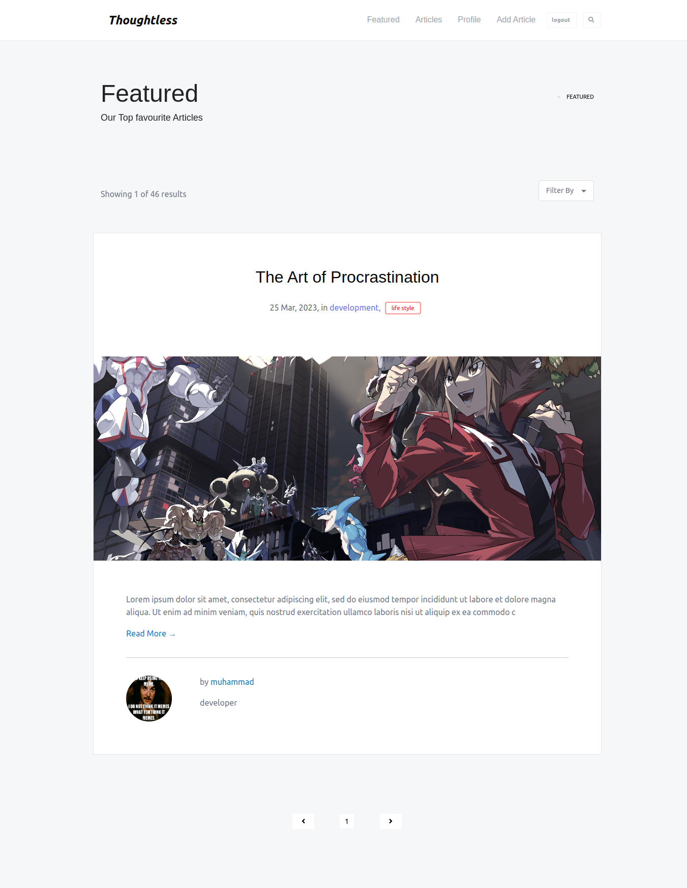

## About ℹ️

Thoughtless is a beautiful blogging platform 
created with django, foundation css and jquery. it supports article creation, comments, authentication, registration, featured articles and search.

<br>

## Setup 🔧

Here is how to setup this template:

<p>1. Clone the repository.</p>

```bash
git clone https://github.com/demon-bixia/Vengeance-Blog.git
```

<p>2. Install dependencies.</p>

```bash
pip install -r requirements.txt
```

<p>3. run the project.</p>

```bash
python manage.py runserver
```

<br>

## Screenshots 📷


<p style="text-align:center;">all  articles</p>
<br/>
<br/>


<p style="text-align:center;">create  articles</p>
<br/>
<br/>


<p style="text-align:center;">register users</p>
<br/>
<br/>


<p style="text-align:center;">user profile</p>
<br/>
<br/>


<p style="text-align:center;">featured  articles</p>
<br/>
<br/>
